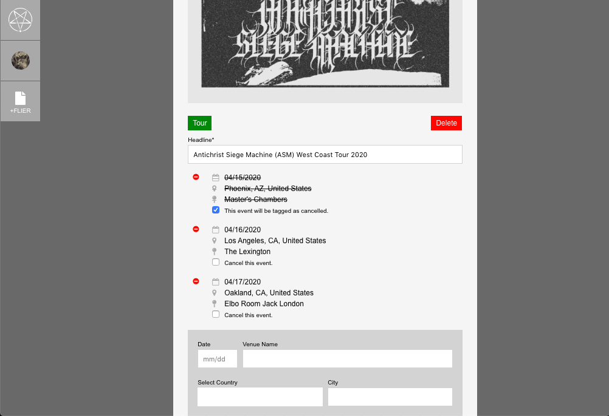

# GoatsGuide

**If you know about an upcoming concert, fest, or tour share the flier here. [goatsguide.com](https://goatsguide.com)**

This is a DIY bulletin board for poster artwork and event information.
If you want to copy/paste from an event already on Facebook or upload an old flier,
that would be a great way contribute.

View more artwork and events from an international scope, as they get posted.
Archive digital references to fliers and shows from your past.

## How it works.

**[Create an account](https://goatsguide.com/public/signup) or [Sign In](https://goatsguide.com/public/signin) to view & share fliers. Forgot your password? There's a link for that. [Recover Password](https://goatsguide.com/public/recover)**

 

**Manage your profile, account settings, posted fliers from your dashboard.**

 

**Post a new flier. Select from 'Single Show', 'Fest', or 'Tour' templates. Complete the event form to make the artwork more searchable.**

 

**Keep your fliers and their events updated. Cancel all tourstops or event dates affected. Cancelling all events on a flier will show a notification tag on the public version.**

 

## Sign in with the demo account to check it out.
- username: demo
- password: demo123

## Technologies

- React 16.12.0
- CSS
- testing with Enzyme
- RESTful API consumer of [goats-api](https://github.com/killeraliens/goats-api)

